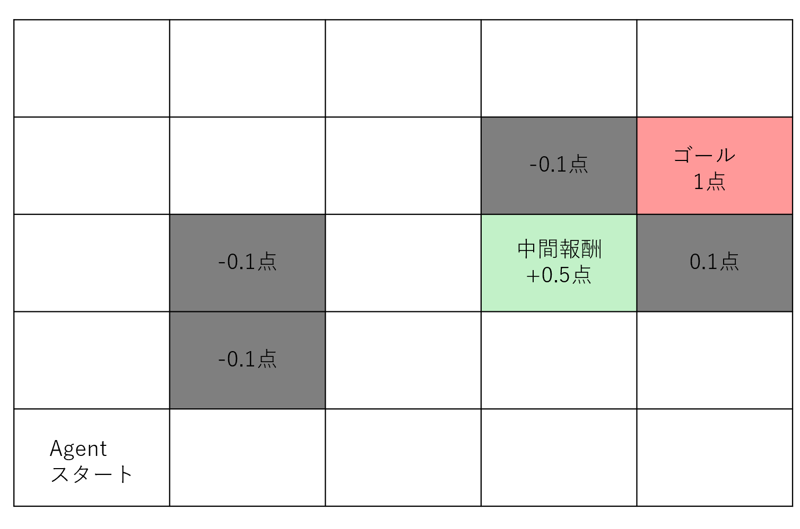
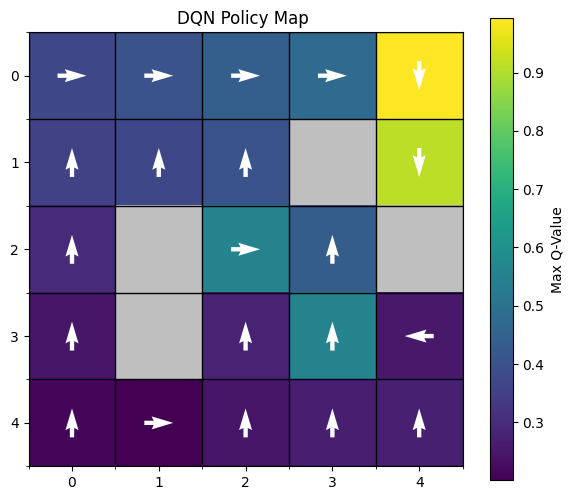
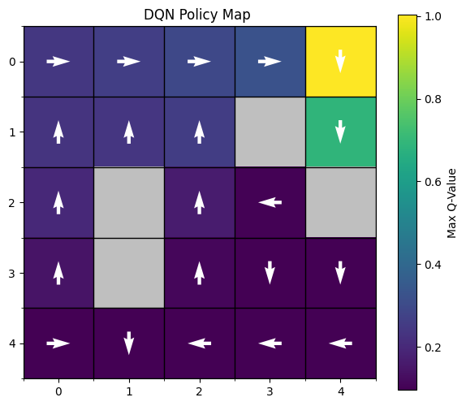

# rust_gridworld_DQN

Rustの機械学習ライブラリ**candle**を使用した、DQNの実装です。

candleは"0.8.2"を使用。

## 目的

Rustの練習のためにGridWorldを作成。

RustのcandleでのDQN実装コードはまだ少ないので、誰かの参考になればと思います。（あえて日本語で書きます）

## fieldの概要

>field図

・5×5のグリッドを設定

・start地点は(4,0)、goalは(1,4)、中間報酬は(2,3)

→中間報酬を設定することで、フラグによって目的を切り替えるかを実験

・エージェントにとって学習しづらいように意図的に壁を(2,1),(3,1),(1,3),(2,4)に配置

→ゴールへ行くには壁沿いを進む必要があるので、マイナス報酬になりやすいのと、中間報酬を取ると次に壁に当たりやすい。

→また、中間報酬とゴール地点を近くに置くことによって、QNetがどっちの報酬かわかりづらくしている

・報酬設定　＝　{　ゴール:1.0点,　中間報酬:0.5点,　壁:-0.1点,　1ステップ:-0.01点　}

## 学習結果(2000エピソード)

以下のヒートマップは中間報酬を取得する前後のQ値の可視化です。

矢印はそのstateでのmax_Qのaction方向です。

## 中間報酬取得前後

>※左:中間報酬前(Pre)、右:中間報酬後(Post)

ゴール付近では黄色になっている。また、グラーデーションになっており、しっかり隣のマスの期待値が伝播しているのがわかる。

中間報酬取る前は、近くを通った時は中間報酬取った方が良く、中間報酬を取った後は即座にゴールに向かっていることがわかる

## 学習時のポイント

探索フェーズを長めに取らないと、ゴールを知る前に探索を終えてしまうため、epsilon_decayは長めに取った方が安定する。

学習率lrは小さすぎると、探索時にゴールしたことを上手く学習できない。大きくし過ぎると、マイナス報酬の頻度が多いので、重みが0になって学習崩壊する。lr = 1e-3あたりがちょうどいいと思います。微調整してください。

## 考察と課題

とりあえずRustでDQNを実装し、学習させることができたが課題は残っている。

気になるポイントは大きく分けて2つある。

1.ゴールの1マス前までしか黄色ではない。

2.スタート地点から中間報酬を取らずに直接ゴールに行くように収束している

